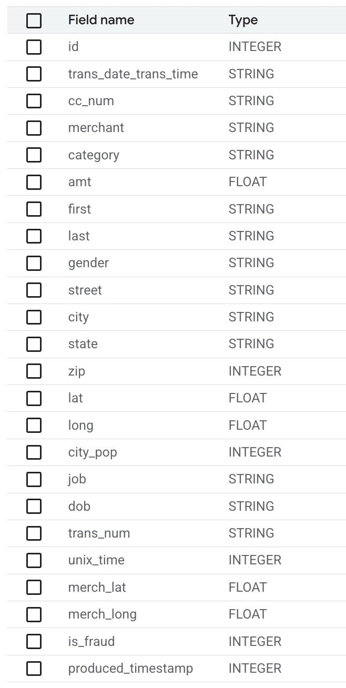
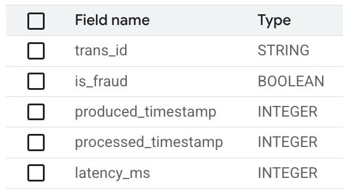

# BigQuery Data for Fraud Detection Project

This folder contains the data files used in the Fraud Detection project. These files provide a look at how data is structured and used in the BigQuery tables for analysis and visualization.

## Folder Contents

- **`transactions_input.csv`**: This file contains raw transaction data, including details such as transaction amount, merchant, category, location, and whether the transaction is fraudulent. It is used as input for the fraud detection pipeline.
- **`fraud_prediction.csv`**: This file contains the output of the fraud detection model, including predictions of whether a transaction is fraudulent, timestamps, and latency information.

## File Descriptions

### `transactions_input.csv`

This file includes the following columns:
- `id`: Unique identifier for the transaction.
- `trans_date_trans_time`: Timestamp of the transaction.
- `cc_num`: Credit card number used in the transaction.
- `merchant`: Merchant where the transaction occurred.
- `category`: Category of the transaction.
- `amt`: Transaction amount.
- `first`, `last`: First and last name of the cardholder.
- `gender`: Gender of the cardholder.
- `street`, `city`, `state`, `zip`: Address details of the cardholder.
- `lat`, `long`: Latitude and longitude of the cardholder's location.
- `city_pop`: Population of the cardholder's city.
- `job`: Job title of the cardholder.
- `dob`: Date of birth of the cardholder.
- `trans_num`: Unique transaction number.
- `unix_time`: Unix timestamp of the transaction.
- `merch_lat`, `merch_long`: Latitude and longitude of the merchant's location.
- `is_fraud`: Indicates whether the transaction is fraudulent (1 for fraud, 0 for legitimate).
- `produced_timestamp`: Timestamp when the transaction data was produced.

### `fraud_prediction.csv`

This file includes the following columns:
- `trans_id`: Unique identifier for the transaction.
- `is_fraud`: Prediction of whether the transaction is fraudulent (true/false).
- `produced_timestamp`: Timestamp when the transaction data was produced.
- `processed_timestamp`: Timestamp when the transaction was processed by the fraud detection model.
- `latency_ms`: Latency in milliseconds for processing the transaction.

## How to Use

1. **Upload to BigQuery**:
   - Use these CSV files to populate the BigQuery tables required for the Fraud Detection project.
   - Ensure the schema of the BigQuery tables matches the structure of these files.

2. **Integrate with Grafana**:
   - Once the data is in BigQuery, it can be queried and visualized using Grafana. Refer to the [Grafana README](../Grafana/README.md) for details on setting up Grafana with BigQuery.

3. **Analyze Data**:
   - Use the data in these files to analyze transaction patterns, detect fraud, and monitor system performance.

## Purpose

These files provide the foundational data for the Fraud Detection project, enabling the creation of dashboards and analytics to monitor and respond to fraudulent activities effectively.